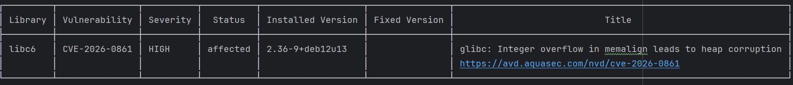

## 1. Create first docker image with app
Just using python:3.10-slim as base image and build fastAPI hello-world app  

[Dockerfile.original](Dockerfile.original)
## 2. Scan CVEs by trivy
scan by trivy  
Result is size 162MB, run as root  
debian layer is largest then python packages and python runtime layer  

```aiignore
 .\tools\trivy\trivy.exe  image --severity HIGH,CRITICAL  api-hardened:day
```

debian package - CRITICAL:0 , HIGH 2  
python package - CRITICAL:0 , HIGH 4  

## 3. Separate builder and runtime stage, then remove build tool
This succeded to remove 3 HIGH CVEs from python side

Debian package - CRITICAL:0 : HIGH 2  No fixed version (glibc)  
python package - CRITICAL:0 : HIGH 1  fixed version there (starlette)  

[Dockerfile.hardened](Dockerfile.hardened)

## 3a. upgrade the fastAPI
fastapi==0.125 then last python CVE is gone

Debian package - CRITICAL:0 : HIGH 2  No fixed version (glibc)  
python package - CRITICAL:0 : HIGH 0  

## 4. run as non-root and readonly mode
create non-root appuser  in runtime stage and confirm by whoami

```aiignore
docker run --rm -p 8000:8000 --read-only --tmpfs /tmp api-distroless:day5
```

## 5. debian distro-less image
Now use community version of distroless debian-python image, there is only UNFIXED CVE remained Finally! 

Debian package - CRITICAL:0 : HIGH 1  No fixed version (glibc)  
python package - CRITICAL:0 : HIGH 0

[Dockerfile.distroless](Dockerfile.distroless)

Total: 1 (HIGH: 1, CRITICAL: 0)




